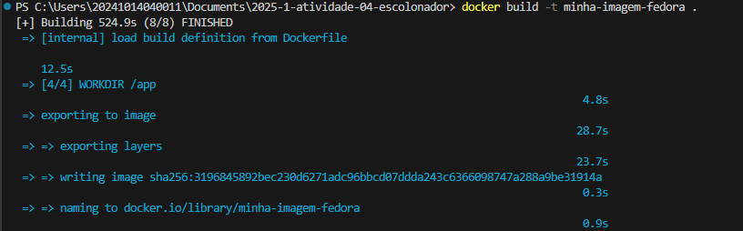

# Relatório de Execução e Modificação do Programa Threads CPU e I/O

---

## 1. Criação da Imagem Docker

O primeiro passo consistiu na criação de uma imagem Docker personalizada, nomeada como **"minha-imagem-fedora"**. Essa imagem serviu como base para o ambiente de execução do programa, garantindo consistência e isolamento.



---

## 2. Execução do Contêiner em Modo Interativo

Em seguida, foi executado um contêiner em modo interativo utilizando a imagem criada anteriormente. Para maior praticidade, foi utilizado o terminal **fish**, proporcionando um ambiente de linha de comando mais amigável e produtivo.


---

## 3. Compilação e Execução do Código Original

No terceiro passo, o código inicial do programa `threads_cpu_io` foi compilado e executado dentro do contêiner. Essa versão original utiliza threads CPU-bound e I/O-bound, onde o cálculo CPU-bound é baseado na série de Taylor para \( e^x \).


---

## 4. Modificações no Código

A seguir, foram realizadas as seguintes modificações no programa:

- **Substituição do cálculo CPU-bound:** O cálculo da série de Taylor para \( e^x \) foi substituído por uma estimativa do valor de \(\pi\), utilizando a série de Leibniz:

\[
\pi \approx 4 \sum_{k=0}^{n} \frac{(-1)^k}{2k + 1}
\]

- **Adição de threads:** Foi incluída uma terceira thread para cada tipo, totalizando três threads CPU-bound e três threads I/O-bound, aumentando a carga de trabalho e a simulação.

- **Aumento da carga computacional:** O número de iterações no cálculo CPU-bound foi expandido para intensificar a demanda computacional e evidenciar melhor a performance das threads.

---

## 5. Compilação e Execução do Código Modificado

Após as alterações, o código foi recompilado e executado dentro do contêiner para validar as mudanças e observar o comportamento com a nova carga e cálculo.


---

## 6. Instalação da Ferramenta de Perfomance `perf`

Para análise detalhada de performance, foi instalado o pacote `perf` utilizando o gerenciador de pacotes `dnf` com o comando:

```bash
dnf -y install perf
```


---

Essa ferramenta permite a coleta de estatísticas detalhadas sobre o uso da CPU, cache, ciclos de clock, entre outros.

## 7. Análise de Performance com `perf`

Por fim, foi utilizada a ferramenta `perf stat` para monitorar a performance do programa executando o comando:

```bash
perf stat ./threads_cpu_io
```

Essa análise forneceu métricas relevantes para avaliar o impacto das modificações na utilização dos recursos do sistema.


---

# Considerações Finais

Este trabalho proporcionou uma experiência prática valiosa na manipulação e análise de threads com diferentes perfis de carga, CPU-bound e I/O-bound. A utilização do Docker como ambiente isolado e replicável foi fundamental para garantir a consistência das execuções e facilitar a gestão das dependências.

As modificações realizadas no código — especialmente a substituição do cálculo de \( e^x \) pela estimativa de \(\pi\) através da série de Leibniz e a inclusão de threads adicionais — aumentaram significativamente a complexidade computacional, permitindo uma avaliação mais realista do comportamento das threads em situações de alta demanda.

Além disso, a instalação e o uso da ferramenta `perf` permitiram coletar métricas detalhadas sobre o desempenho do programa, como ciclos de CPU, cache misses e instruções executadas, fornecendo uma visão profunda dos recursos consumidos e apontando possíveis gargalos para futuras otimizações.

Em resumo, o processo desenvolvido reforça a importância de combinar técnicas de programação concorrente com ferramentas de análise de performance em ambientes controlados, promovendo um entendimento mais sólido e a capacidade de desenvolver aplicações mais eficientes e escaláveis.
